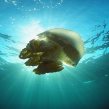
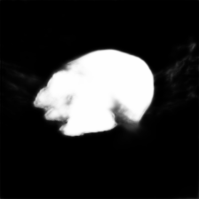
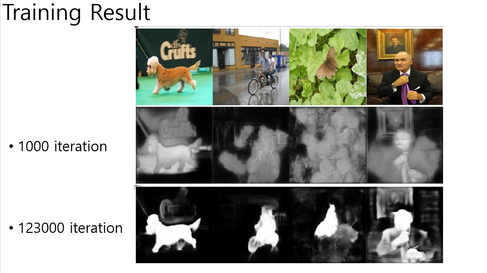

# PiCANet-Implementation
Pytorch Implementation of [**PiCANet: Learning Pixel-wise Contextual Attention for Saliency Detection**](https://arxiv.org/abs/1708.06433)

## Some Implementation errors
* **[All of the conv kernels in DecoderCell(nn.Module) should be set to 1x1 #8](https://github.com/Ugness/PiCANet-Implementation/issues/8)**
* Adjusted code in [branch:adjusted](https://github.com/Ugness/PiCANet-Implementation/tree/Adjusted_Picanet). I will merge the branch after training and testing adjusted model. (about 9/20)
* Thanks for @Sucran's advice.







# PPT(Korean)
https://www.slideshare.net/JaehoonYoo5/picanet-pytorch-implementation-korean


# Top 10 Performance Test with F-score (beta-square = 0.3)  (Conv block by 3*3 different from paper)
| Step   | Value    |
|--------|----------|
| 55000  | 0.827128 |
| **123000** | **0.837655** |
| 130000 | 0.825695 |
| 139000 | 0.823819 |
| 159000 | 0.824045 |
| 180000 | 0.833425 |
| 194000 | 0.829462 |
| 218000 | 0.823438 |
| 227000 | 0.823538 |
| 243000 | 0.825455 |

# Top 10 Performance Test with F-score (beta-square = 0.3)  (Conv block by 1*1 same as paper: [branch:Adjusted](https://github.com/Ugness/PiCANet-Implementation/tree/Adjusted_Picanet))
| Step   | Value    |
|--------|----------|
| 94000  | 0.808461 |
| 116000 | 0.803307 |
| **141000** | **0.815086** |
| 148000 | 0.803823 |
| 151000 | 0.806831 |
| 152000 | 0.805117 |
| 158000 | 0.813095 |
| 162000 | 0.813473 |
| 179000 | 0.806976 |
| 188000 | 0.803061 |


# Execution Guideline
## Requirements
Pillow==4.3.0  
pytorch==0.4.1  
tensorboardX==1.1  
torchvision==0.2.1  
numpy==1.14.2  

## My Environment
S/W  
Windows 10  
CUDA 9.0  
cudnn 7.0  
python 3.5  
H/W  
AMD Ryzen 1700  
Nvidia gtx 1080ti  
32GB RAM

## Docker environment
```
docker run --name=torch -it -rm pytorch/pytorch
pip install tensorboardX
pip install datetime
git clone https://github.com/Ugness/PiCANet-Implementation
```

## Docker image(Unstable)
https://hub.docker.com/r/wogns98/picanet/  
based on pytorch/pytorch  
codes in /workspace/PiCANet-Implementation  
You can run code by add images and download models from [google drive](https://drive.google.com/file/d/109a0hLftRZ5at5hwpteRfO1)  

## You can run the file by following the descriptions in -h option.
<code>
    python train.py -h
</code>
<pre>
    usage: train.py [-h] [--load LOAD] [--dataset DATASET] [--cuda CUDA]
                [--batch_size BATCH_SIZE] [--epoch EPOCH] [-lr LEARNING_RATE]
                [--lr_decay LR_DECAY] [--decay_step DECAY_STEP]
    
    optional arguments:
    -h, --help            show this help message and exit
    --load LOAD           Directory of pre-trained model, you can download at 
                        https://drive.google.com/file/d/109a0hLftRZ5at5hwpteRfO1
                        A6xLzf8Na/view?usp=sharing
                        None --> Do not use pre-trained model. 
                        Training will start from random initialized model
    --dataset DATASET     Directory of your DUTS dataset "folder"
    --cuda CUDA           'cuda' for cuda, 'cpu' for cpu, default = cuda
    --batch_size BATCH_SIZE
                        batchsize, default = 1
    --epoch EPOCH         # of epochs. default = 20
    -lr LEARNING_RATE, --learning_rate LEARNING_RATE
                        learning_rate. default = 0.001
    --lr_decay LR_DECAY   Learning rate decrease by lr_decay time per decay_step, default = 0.1
    --decay_step DECAY_STEP
                        Learning rate decrease by lr_decay time per decay_step, default = 7000
</pre>

<code>
    python Image_Test.py -h
</code>
<pre>
    usage: Image_Test.py [-h] [--model_dir MODEL_DIR] [-img IMAGE_DIR]
                         [--cuda CUDA] [--batch_size BATCH_SIZE]

    optional arguments:
      -h, --help            show this help message and exit
      --model_dir MODEL_DIR
                            Directory of pre-trained model, you can download at
                            https://drive.google.com/drive/folders/1s4M-_SnCPMj_2rsMkSy3pLnLQcgRakAe?usp=sharing
      -img IMAGE_DIR, --image_dir IMAGE_DIR
                            Directory of your test_image ""folder""
      --cuda CUDA           'cuda' for cuda, 'cpu' for cpu, default = cuda
      --batch_size BATCH_SIZE
                            batchsize, default = 4
</pre>

## Detailed Guideline
### Pretrained Model
You can download pre-trained models from https://drive.google.com/drive/folders/1s4M-_SnCPMj_2rsMkSy3pLnLQcgRakAe?usp=sharing  
### Dataset
I used DUTS dataset as Training dataset and Test dataset.  
You can download dataset from http://saliencydetection.net/duts/#outline-container-orgab269ec.
* Caution: You should check the dataset's Image and GT are matched or not. (ex. # of images, name, ...)
* You can match the file names and automatically remove un-matched datas by using DUTSdataset.arrange(self) method

### Execution Example
Assume you train the model with  
* current dir: Pytorch/  
* Dataset dir: Pytorch/DUTS-TE  
* Pretrained model dir: Pytorch/models/state_dict/07261950/10epo_1000000step.ckpt  
* Goal Epoch : 100  
<code>
    python train.py --load models/state_dict/07261950/10epo_1000000step.ckpt --dataset DUTS-TE --epoch 100
</code>

Assume you test the model with  
* current dir: Pytorch/  
* Testset dir: Pytorch/test  
* Pretrained model dir: Pytorch/models/state_dict/07261950/10epo_1000000step.ckpt  
* CPU mode  
<code>
    python Image_test.py --model_dir models/state_dict/07261950/10epo_1000000step.ckpt --img test --cuda cpu
</code>

### Directory & Name Format of .ckpt files
<code>
        "models/state_dict/<datetime(Month,Date,Hour,Minute)>/<#epo_#step>.ckpt"
</code>

* The step is accumulated step from epoch 0.
* If you want to change the format of pre-trained model, you should change the code in train.py line 61-65
    ```
    start_iter = int(load.split('epo_')[1].strip('step.ckpt')) + 1
    start_epo = int(load.split('/')[3].split('epo')[0])
    now = datetime.datetime.strptime(load.split('/')[2], '%m%d%H%M')
    ```

### Test with Custom_Images
* When you run Image_Test.py with your own Images, the images will saved in tensorboard log file.

* Log files will saved in log/Image_test

* You can see the images by execute
    ```
    tensorboard --logdir=./log/Image_test
    ```

    and browse 127.0.0.1:6006 with your browser(ex. Chrome, IE, etc)
